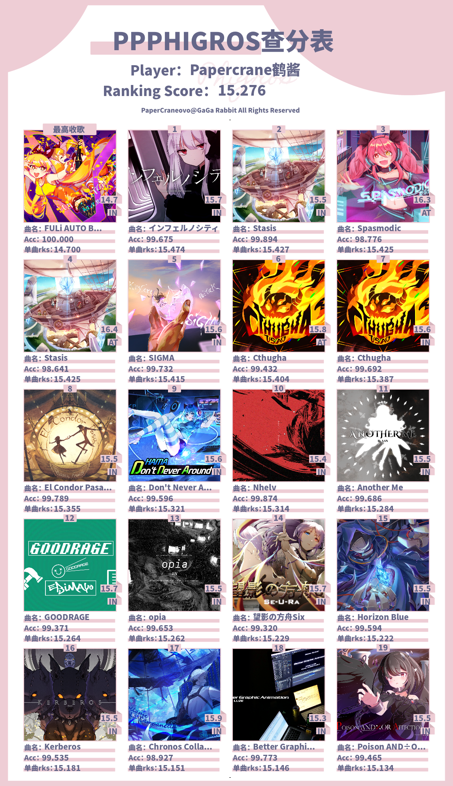

# 基于mirai和Graia Ariadne开发的shiro bot
> 名字取自动漫《樱花庄的宠物女孩》中的 **椎名真白(Shiina Mashiro)** ,真白酱那么可爱,是吧是吧!

## 部署
`pip install -r requirements.txt`  

为了部分数据及隐私保护,phigros模块下的api和api_key需要自行解决,以及main.py中的qq账号也未公开(其实看历史是能看到的).我采用了keyring,你的设备上应该没有这个信息.

部分资源也没有公开.所以本仓库并不是开箱即用,仅为学习用.部署出问题不要来找我(bushi),毕竟这么烂的代码肯定也没有读下去的必要.

## TODO
- phigros 模块
  - [x] phigros 查分,文字版 b19
  - [x] 随机推荐 phigros 曲目(支持AI酱风格)
  - [x] 别名系统 (基本建立,但需要社区努力)
  - [x] 图片版 b19 (美工压力 upup )(历时1天,终于做出来了)
  - [x] 单曲查询
  - [x] 曲目信息查询
  - [ ] 猜歌系统(优先度较低,可能不会做)
  - [ ] ...
  > ~~虽然 **ArcaeaUnlimitedApi** 可用,但有偷妈头这么厉害的bot在,还是先写其他功能比较好.~~
  > **ArcaeaUnlimitedApi** 已不可用,开发组已停止维护,616sb.本bot可能会考虑使用其他方式增加arcaea模块.(只是可能)

  [phigros 模块](./modules/phigros/README.md)

- 娱乐模块
  - [ ] 人生重开模拟器
  - [ ] 聊天功能(炼个模型 之后再说)
  - [ ] 狼人杀(最初的想法)
  - [ ] 锅
  - [ ] ...
  > 不会接入 chatGPT 的,永远不会.
- 管理模块
  - [ ] 功能管理
  - [x] 自助头衔
  - [ ] 自动审核入群( pku 专供)
  - [ ] ...?

  [manager 模块](./modules/manager/README.md)

附上目前的新功能: 图片版 b19 示例一张:

## License
遵循mirai开源协议,本bot采用AGPLv3开源.请注意,AGPLv3是传染性开源协议.